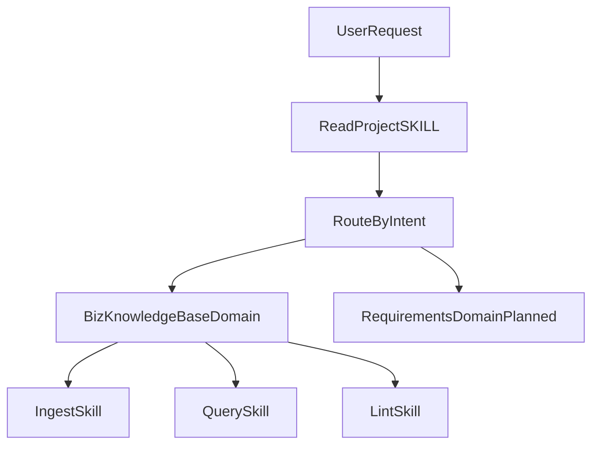

# Product Delivery Workbench MVP Plan

## Current MVP Scope

- Publish a skill-driven repository that works from GitHub URL + `README.md` + `SKILL.md`.
- Keep one active domain today: `biz-knowledge-base`.
- Support three core skills in that domain:
  - `ingest`
  - `query`
  - `lint`
- Keep project-level and domain-level global rules separated for maintainability.

## Current Structure

- [README.md](../README.md): product positioning and usage entry.
- [SKILL.md](../SKILL.md): project-level global rules and domain routing policy.
- [skills/biz-knowledge-base/SKILL.md](../skills/biz-knowledge-base/SKILL.md): domain global rules and routing defaults.
- [skills/biz-knowledge-base/ingest.md](../skills/biz-knowledge-base/ingest.md): ingest skill.
- [skills/biz-knowledge-base/query.md](../skills/biz-knowledge-base/query.md): query skill.
- [skills/biz-knowledge-base/lint.md](../skills/biz-knowledge-base/lint.md): lint skill.
- [docs/pre-publish-review-checklist.md](../docs/pre-publish-review-checklist.md): publish gate checklist.
- [docs/sensitive-keywords.txt](../docs/sensitive-keywords.txt): configurable sensitive keyword list.

## Routing Model

## Acceptance Criteria (Current MVP)

- Project-level and domain-level rules are clearly separated.
- Default routing behavior is defined and safe when intent is unclear.
- `ingest/query/lint` are available under `skills/biz-knowledge-base/`.
- Pre-publish checklist and sensitive keyword scan process are available in `docs/`.
- User-facing docs are concise and consistent with the current repository layout.
